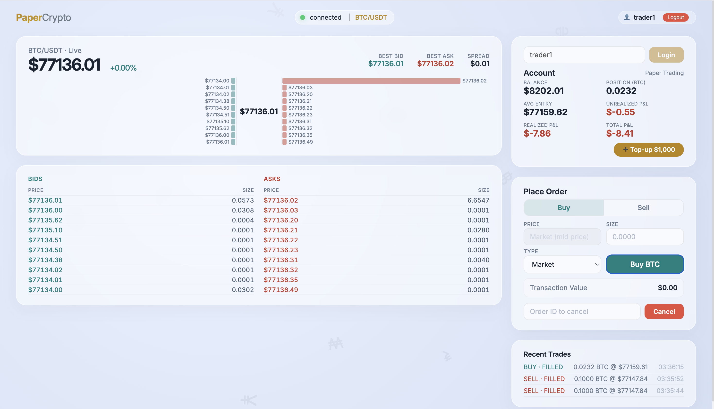
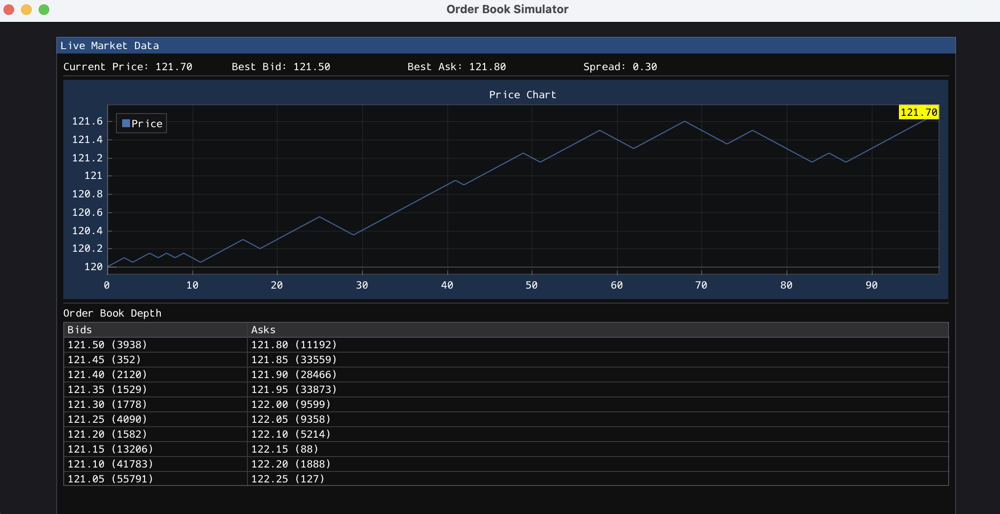
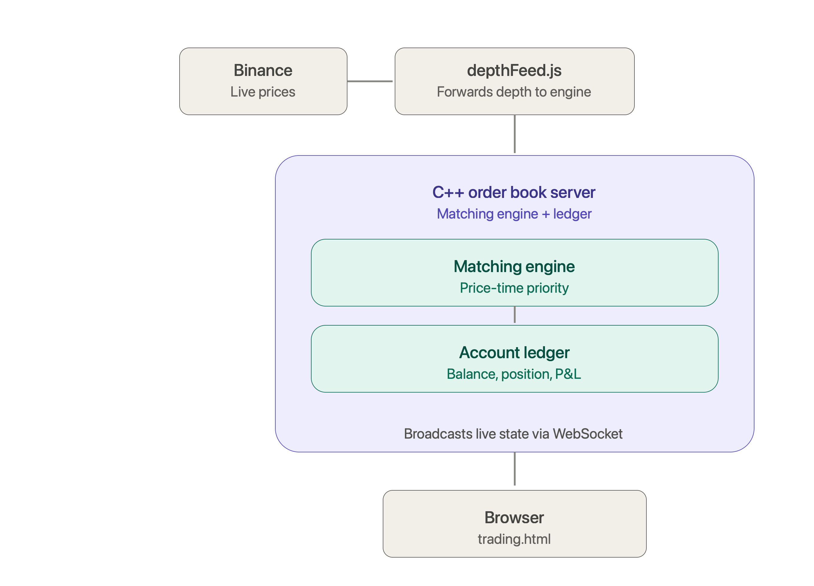

# Crypto Paper Trading Platform

A real-time BTC/USDT paper trading platform powered by a custom C++ matching engine, live Binance market data, and instant WebSocket updates — trade with virtual funds against a real, live order book.

** Live Demo:** [https://orderbook-simulator.onrender.com/](#)

No signup friction — enter any username and start trading immediately with $10,000 in virtual funds.

PaperCrypto - for Real time crypto trading experience

Simulator Load Test 

---

## Features

- **Built a matching engine from scratch** — price-time priority order matching in C++17, not a wrapper around an existing library
- **Real market data, not simulated noise** — live BTC/USDT order book streamed directly from Binance, refreshed 10x/second
- **Correct exchange semantics** — resting limit orders can be cancelled; filled orders (market or limit) cannot, exactly like a real exchange
- **Real-time everything** — order book, price, and account state pushed live via WebSocket, zero polling
- **Full trading loop** — place orders, get filled against live liquidity, watch balance and P&L update instantly
- **Deployed and dockerized** — containerized, reproducible builds, running live in production

---

## Architecture

---
## Tech Stack

**Backend:** C++17 · uWebSockets · nlohmann/json
**Market Data:** Node.js · Binance WebSocket API
**Frontend:** HTML/CSS/JavaScript · WebSocket API
**Infra:** Docker · CMake

---

## Try it

1. Open the [live demo](#)
2. Enter a username — no signup required
3. Place a market or limit order and watch it fill against live BTC prices
4. Track your P&L update in real time as the market moves
